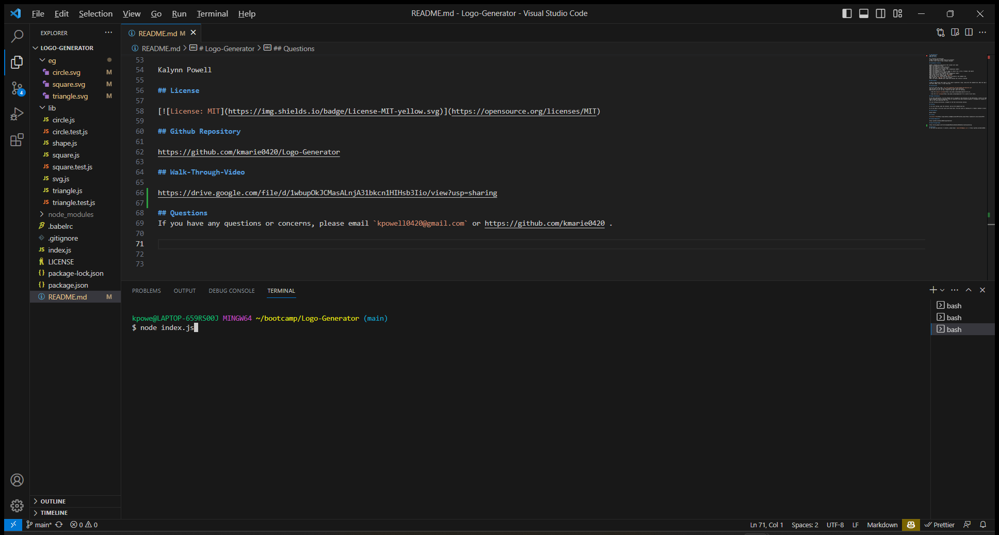
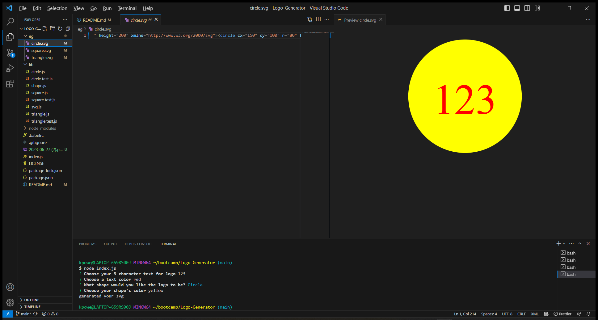
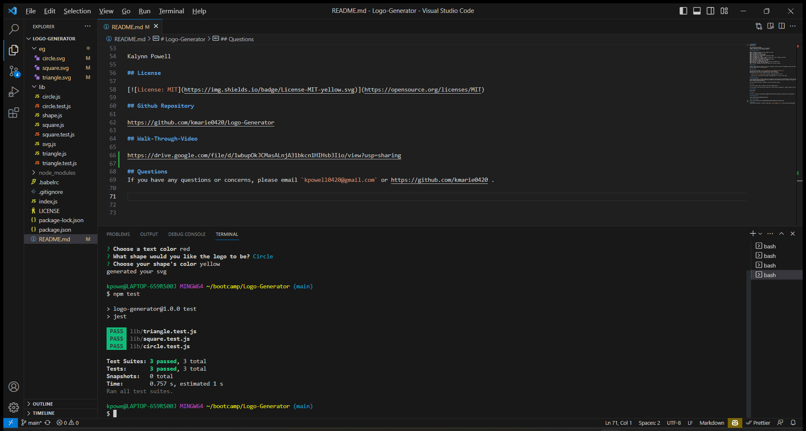

# Logo-Generator
Logo Generator
### User Story

AS a freelance web developer
I WANT to generate a simple logo for my projects
SO THAT I don't have to pay a graphic designer

## Acceptance Criteria

GIVEN a command-line application that accepts user input
WHEN I am prompted for text
THEN I can enter up to three characters
WHEN I am prompted for the text color
THEN I can enter a color keyword (OR a hexadecimal number)
WHEN I am prompted for a shape
THEN I am presented with a list of shapes to choose from: circle, triangle, and square
WHEN I am prompted for the shape's color
THEN I can enter a color keyword (OR a hexadecimal number)
WHEN I have entered input for all the prompts
THEN an SVG file is created named `logo.svg`
AND the output text "Generated logo.svg" is printed in the command line
WHEN I open the `logo.svg` file in a browser
THEN I am shown a 300x200 pixel image that matches the criteria I entered

## Description

A Node.js application that takes in user input to generate a logo, using only the command-line. When the logo is generated, it is saved and stored in a SVG file. The user has options with what shape, color, or text they want.

## Installation

First git clone this repo: `git clone git@github.com:kmarie0420/Logo-Generator.git` 
Then run npm i at the root of this project in your local directory.
Additionally you will run npm i inquirer and npm i jest (for testing).

  * Uses the [Inquirer package](https://www.npmjs.com/package/inquirer/v/8.2.4).

  * Uses the [Jest package](https://www.npmjs.com/package/jest) for a suite of unit tests.

## Usage Information

To run this application, use the command line to navigate to the directory of the application, install all dependencies (npm i), then type the command node index.js. You will then be taken through a series of questions. Once all questions have been answered properly, a message will display to the command line telling you, your logo has been generated. Find your new logo in the newly generated SVG file.

For unit testing instructions, navigate to the Test Instructions section.

## Testing

To run unit testing, open the terminal, and use the command npm test.

As of now there is one test suite with three tests. The test suite is checking for a render() method to return a string for the corresponding SVG file with the given shape color.

## Contributors

Kalynn Powell

## License

## Github Repository

https://github.com/kmarie0420/Logo-Generator

## Walk-Through-Video

https://drive.google.com/file/d/1wbupOkJCMasALnjA31bkcn1HIHsb3Iio/view?usp=sharing

## Questions

If you have any questions or concerns, please email `kpowell0420@gmail.com` or https://github.com/kmarie0420 .  

## Credits

* [Example SVG](https://static.fullstack-bootcamp.com/fullstack-ground/module-10/circle.svg)

* [Scalable Vector Graphics (SVG)](https://en.wikipedia.org/wiki/Scalable_Vector_Graphics)

* [SVG tutorial](https://developer.mozilla.org/en-US/docs/Web/SVG/Tutorial)

* [Basic SVG shapes](https://developer.mozilla.org/en-US/docs/Web/SVG/Tutorial/Basic_Shapes)

* [Text in SVG](https://developer.mozilla.org/en-US/docs/Web/SVG/Tutorial/Texts)

* [SVG VS Code extension](https://marketplace.visualstudio.com/items?itemName=jock.svg)

